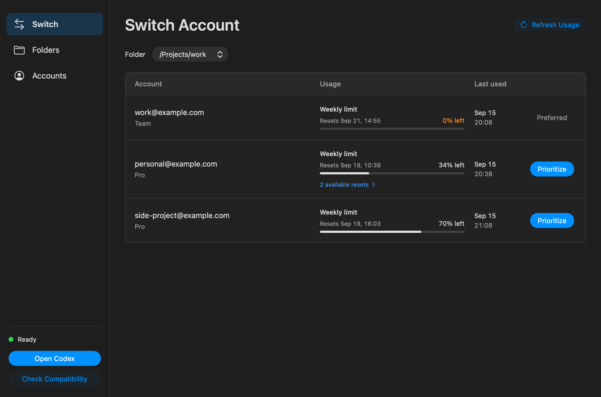

# Codex Turnrail

A macOS menu bar app for using multiple ChatGPT accounts with Codex in the official ChatGPT app.

Keep your Codex conversations as you switch accounts, with automatic account selection for each folder.

This is an independent project with no affiliation with or endorsement from OpenAI.

## Install

Requires an Apple silicon Mac running macOS 14 or later and the [supported ChatGPT macOS app](upstream.toml) installed at `/Applications/ChatGPT.app`. The ChatGPT app version and build must match exactly.

1. [Download Codex Turnrail for macOS (Apple silicon)](https://github.com/kosukesaigusa/codex-turnrail/releases/download/v0.4.1/Codex-Turnrail-v0.4.1-macos-arm64.zip).
2. Double-click the ZIP, then drag `Codex Turnrail.app` into **Applications**.
3. Quit ChatGPT if it is running, open **Codex Turnrail**, and select **Check Compatibility**.

Only the app ZIP is needed. No Terminal commands are required.

> **Usage notice:** Do not use Codex Turnrail to circumvent OpenAI's rate limits or usage limits. You are responsible for complying with the terms that apply to your accounts and your organization's policies. Use at your own risk.
>
> OpenAI prohibits "circumvent any rate limits or restrictions" in its [Terms of Use](https://openai.com/policies/row-terms-of-use/) and "violate or circumvent Usage Limits" in its business [Services Agreement, Section 3.3(i)](https://openai.com/policies/services-agreement/) (excerpts).

## Set up

1. In **Accounts**, select **Add Account** and sign in to your ChatGPT accounts.
2. In **Folders**, add a folder and assign its permitted accounts.
3. Review quota and set account priority in **Switch**, then select **Open Codex** to launch ChatGPT with Turnrail's account routing.

Folder rules apply to subfolders. The Engine selects an available account from the matching rule before each turn. Active turns keep their account; changes apply to the next turn.

**Switch** and **Accounts** show remaining usage, reset times, and last-used times. Select **available resets** to view each saved reset and its expiration date. Reset counts appear only when at least one is available. Reauthentication and account removal are in the **Accounts** menu.

## Conversation data

Account credentials are stored separately in macOS Keychain. Conversation history uses the shared `~/.codex` store.

Switching accounts carries the existing conversation context into the next request under the selected account. Assign only accounts that may receive that folder's code and conversation history. Keep work folders restricted to accounts approved for that work.

Removing an account deletes its Turnrail credentials and account settings. Shared conversation history remains.

## Development

The Swift app lives in `app/` and the Codex Engine in `engine/`. It launches ChatGPT with a dedicated Codex Engine, preserving the official app's bundle and signature. Use the root `justfile` for builds and checks.

See [Development](docs/development.md) to build from source and [Verification](docs/verification.md) for validation results and remaining checks.

See [Architecture](docs/architecture.md) for routing and storage details, [Engine](docs/engine.md) for upstream provenance, [Releases](docs/releases.md) for versioning and upstream automation, and [Roadmap](docs/roadmap.md) for remaining work. Read [Contributing](CONTRIBUTING.md) before proposing changes and [Security](SECURITY.md) to report a vulnerability privately.

## License

Codex Turnrail is licensed under [Apache-2.0](LICENSE). The Engine retains its upstream [license](engine/LICENSE), [NOTICE](engine/NOTICE), and component-specific licenses. Packaged apps include the applicable license texts and notices.
